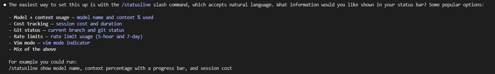
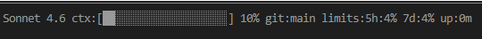
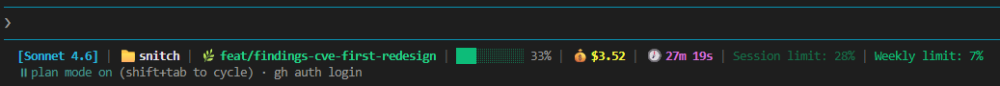

# Claude Code Status Bar Guide

How to add a custom status bar to Claude Code showing model, context, git status, cost, and rate limits.

---

## Option 1 — Automated setup

Run `/statusline` in Claude Code and describe what you want in plain English.



Example prompt used here:

```text
/statusline show model name, context percentage with a progress bar, git status, rate limits and session duration
```

Result:



---

## Option 2 — Manual setup

**Prerequisites:** `jq` must be installed (`brew install jq` / `apt install jq`). `git` is required for branch display but optional.

For full control over layout and color coding, copy [`statusline.sh`](statusline.sh) to your home directory and make it executable:

```bash
cp statusline.sh ~/.claude/statusline.sh && chmod +x ~/.claude/statusline.sh
```

Then add the following to `~/.claude/settings.json` to tell Claude Code to use it:

```json
{
  "statusBarCommand": "~/.claude/statusline.sh"
}
```

This gives you a richer bar with color-coded context usage, rate limits, cost, and duration.



---

## Further reading

[Anthropic status line documentation](https://code.claude.com/docs/en/statusline)
